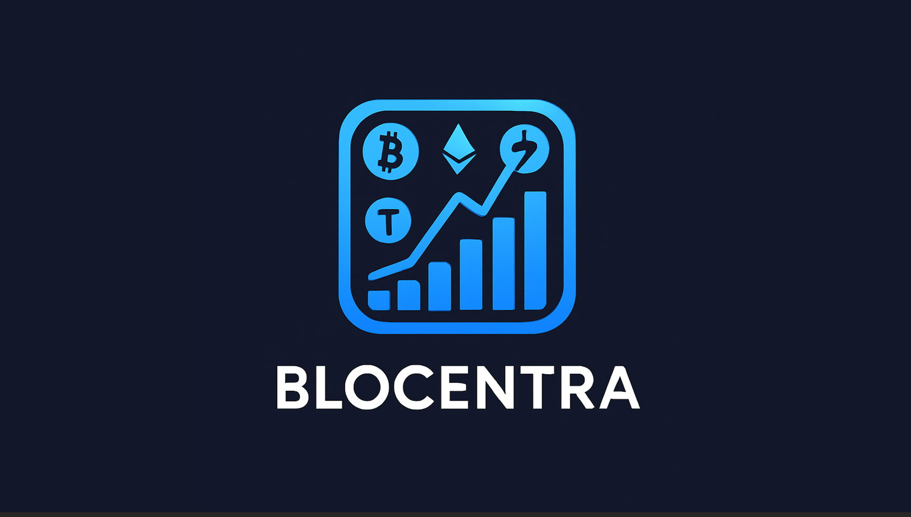
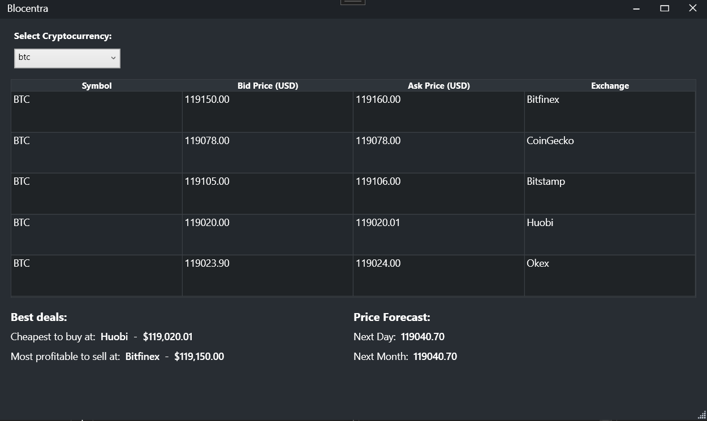

# Blocentra

A WPF application for cryptocurrency price tracking, analysis, and forecasting. Supports multiple exchanges such as Bitfinex, Bitstamp, CoinGecko, Huobi, and Okex. The app provides real-time price comparison, historical data storage, and predictive analytics using ML.NET time series forecasting.

## Features

- Fetches cryptocurrency prices from multiple exchanges.
- Compares bid/ask prices to identify best buying/selling opportunities.
- Stores historical cryptocurrency data locally in JSON format.
- Predicts future prices using ML.NET Time Series Forecasting.
- Customizable window controls via a dedicated service.

## Requirements

- .NET 6.0 or later
- ML.NET 2.0 or later
- Newtonsoft.Json
- Prism Library
- Internet connection for live API data
